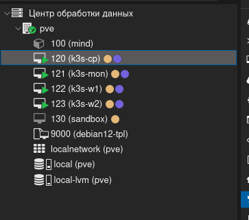
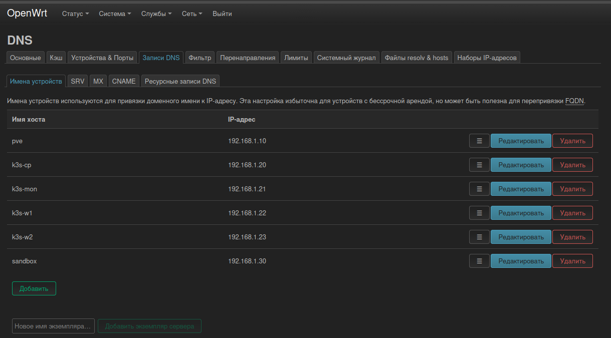
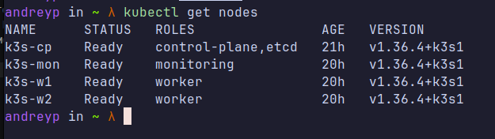

# generic

Для выполнения лабораторных работ, буду использовать сервер с прокмокс. Сервер является игровым ПК, в который я поставил в кладовку и накатил на него Proxmox. Он не сильно мощьный, но доту тянул на максималках,  для выполнения лаб должно хватить(надеюсь).

### Характеристики сервера: 

- Процессор: AMD Ryzen 5 5500
- RAM: 16ГБ
- SSD: 512ГБ
- Видеокарта(GPU): GTX 1650(можно локальную модель развернуть(очень маленькую), но для курса мб не понадобится)
- OC: Debian GNU/Linux 13 (trixie) | Proxmox VE 9.1.1

Также есть роутер, на нем будет стоят все сетвая инфраструктура(DNS, DHCP, и тд)

### Описание инфраструктуры

Посмотрев лабы, сделал вывод, что для их выполнения нужен свой небольшой кластер с кубером. Выбрал k3s, тк он довольно легкий + сразу все есть из коробки, и по факту является аналогом K8s. 

И накидал вот такую схему(будет доплонятся и изменятся):

#### Характеристики ВМ:

| ВМ | CPU | RAM | Диск |
|---|---|---|---|
| `k3s-cp` | 2 | 2.5 ГБ | 25 ГБ |
| `k3s-mon` | 2 | 6 ГБ | 40 ГБ | 
| `k3s-w1` | 3 | 2.5 ГБ | 25 ГБ |
| `k3s-w2` | 3 | 2.5 ГБ | 25 ГБ |
| `sandbox` | 4 | 4 ГБ | 25 ГБ | 

### Создания виртуальных машин

Создал для работы кластера 4 вируталки,  и еще одну для тестов(sandbox). В качестве ОС выбрал Debian 12( уже был на проксмоксе ). Для простоты, был заготовлен шаблон вм с дебной и также уже все нужное настроено для cloude-init запуска вм. Очень удобная штука, прям в интерфейсе накликиваешь айпишники, характеристики и вм готова, почти тоже самое что у какого то облака, но бесплатно и свое. 

Созданные виртуалки:

### Назначение доменного имени 

Для более удобной работы с вм, и кластером в частности, назначу вм DNS имена, в локальной сети. У меня стоит роутер, и у него как раз есть функция с DNS его и буду использовать:

Назначение доменных имен вм:

### Установка кластера

Для установки кластера на ВМ буду использвать ансибл. Тут подробно не буду описывать, что именно делает код. Из крутого, что сделал, после установки кластера kubeconfig автоматом прокидывается на ноутбук в настройки. [В папке](ansible/) есть все исходники, и +- все читабильно. Взможно, быстрее было бы вбить команды напрмую на сервере из документации, но это тоже практика, и возможно где то еще пригодится.

