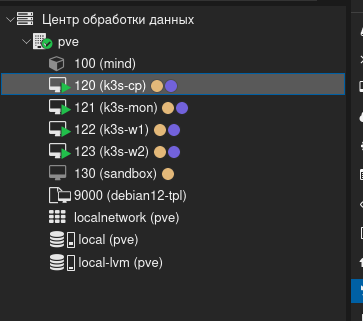
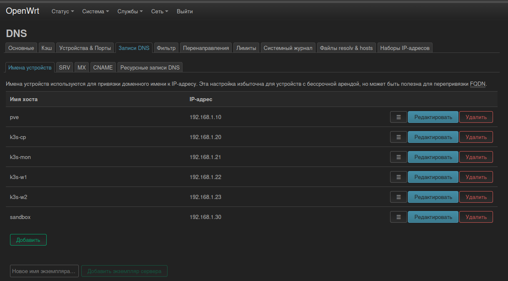
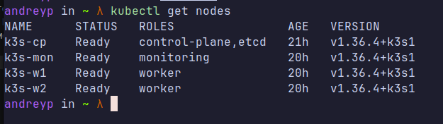

# generic

Для выполнения лабораторных работ буду использовать сервер с Proxmox. Сервер — это игровой ПК, который я убрал в кладовку и накатил на него Proxmox. Он не сильно мощный, но доту тянул на максималках, для выполнения лаб должно хватить (надеюсь).

### Характеристики сервера: 

- Процессор: AMD Ryzen 5 5500
- RAM: 16ГБ
- SSD: 512ГБ
- Видеокарта(GPU): GTX 1650(можно локальную модель развернуть(очень маленькую), но для курса мб не понадобится)
- ОС: Debian GNU/Linux 13 (trixie) | Proxmox VE 9.1.1

Также есть роутер, на нём будет стоять вся сетевая инфраструктура (DNS, DHCP и т. д.)

### Описание инфраструктуры

Посмотрев лабы, сделал вывод, что для их выполнения нужен свой небольшой кластер с кубером. Выбрал k3s, так как он довольно лёгкий, сразу всё есть из коробки и по факту это полноценный Kubernetes. 

И накидал вот такую схему (будет дополняться и изменяться):

#### Характеристики ВМ:

| ВМ | CPU | RAM | Диск |
|---|---|---|---|
| `k3s-cp` | 2 | 2.5 ГБ | 25 ГБ |
| `k3s-mon` | 2 | 6 ГБ | 40 ГБ | 
| `k3s-w1` | 3 | 2.5 ГБ | 25 ГБ |
| `k3s-w2` | 3 | 2.5 ГБ | 25 ГБ |
| `sandbox` | 4 | 4 ГБ | 25 ГБ | 

### Создание виртуальных машин

Создал для работы кластера 4 виртуалки и ещё одну для тестов (sandbox). В качестве ОС выбрал Debian 12 — его образ уже лежал на Proxmox. Для простоты заготовил шаблон ВМ с Debian, в котором уже настроено всё нужное для запуска через cloud-init. Очень удобная штука: прямо в интерфейсе накликиваешь адреса и характеристики, и ВМ готова. Почти то же самое, что в облаке, только бесплатно и своё. 

Созданные виртуалки:

### Назначение доменного имени 

Для более удобной работы с ВМ, и с кластером в частности, назначу им DNS-имена в локальной сети. У роутера как раз есть своя функция DNS, её и буду использовать:

Назначение доменных имён ВМ:

### Установка кластера

Для установки кластера на ВМ буду использовать Ansible. Тут подробно не буду описывать, что именно делает код. Из крутого: после установки кластера kubeconfig автоматом прокидывается на ноутбук. [В папке](ansible/) есть все исходники, и плюс-минус всё читабельно. Возможно, быстрее было бы вбить команды напрямую на сервере по документации, но это тоже практика, и где-нибудь ещё пригодится.

