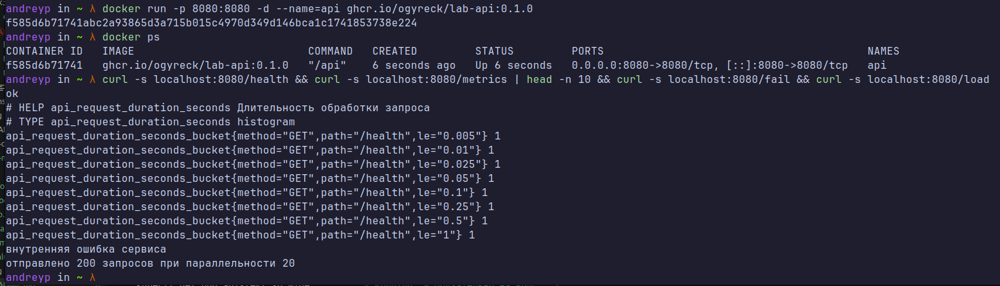
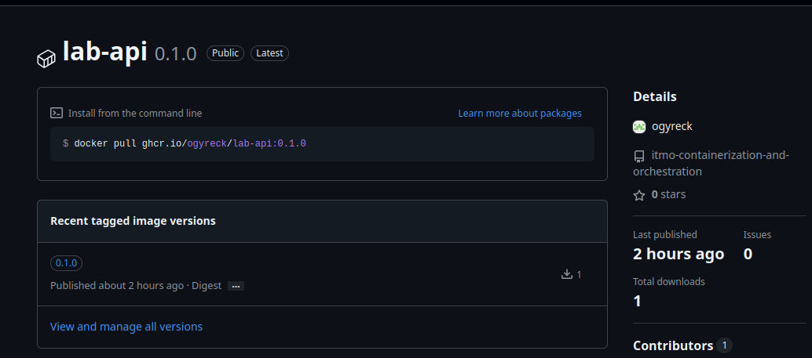
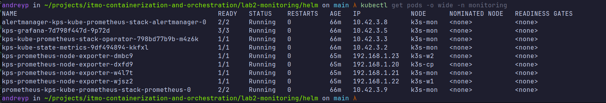
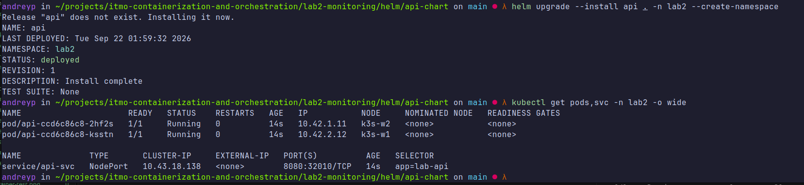
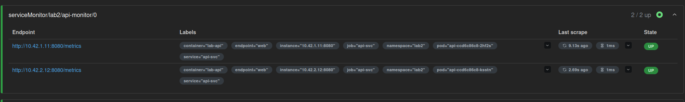

# Лаба 2 — Мониторинг сервиса: метрики, логи, трейсы

В данной лабораторной работе нужно поднять полноценный стек мониторинг и замониторить его.

Описание лабы - [ссылка](https://github.com/KeladKaal/containerization-and-orchestration/blob/main-rus/lecture-2-observability/lab.md)

## Часть 0 - Свой сервис

Нужно наспиать свой небольшой сервис  api, который будет отдавать метрики. В качетсве языка выбрал Go, до этого с ним не работал, но для разнообразия решил попробовать. Написание сервиса полностью отдал Claude. Справился он с этим бодро. Сам сервис собрал в виде контейнера и запущил в гитхаб реджистари, чтоб в дальнейшем его использовать. 

Проверяем работоспособность



Все работает, метрики выводятся

И пушим его в ghcr



## Часть 1 - Метрики (Prometheus + Grafana)

### 1.1 Поднимаем стек мониторитнга
Для начала нужно это все развернуть. Для разворачивания буду использовать k3s в домашней лаборатории. Описание стенда, а также как его разворачивал кластер описано [вот тут](../generic/README.md). В кратце, решил сделать себе отдельную ноду чисто под мониторинг. Задумка в том, чтоб сам стек обсервабилити находлося где то вне, самой системы. Для этого при установки ноды агента, прописал в конфиге парметры: `k3s_node_labels:"purpose=monitoring"` и `k3s_node_taints: "purpose=monitoring:NoSchedule"`. Задумка хорошая, но добавляет небольших трудностей при распределении приложений на разные ноды. Д 

В качетсве основы, нашел такой вот [helm чарт](https://artifacthub.io/packages/helm/prometheus-community/kube-prometheus-stack#configuration)
Немного почитав документацию, и понял, что для настройки нужен value.yml, который разработчики предоставили в качестве примера

Выполнив команду `helm show values oci://ghcr.io/prometheus-community/charts/kube-prometheus-stack > value.yml`, получил файл на 6к строк. 6к!!!

После изучения всего этого, понял, что мне нужно, не все 6к строк. Поэтому нашел более простую версию файла, и подогнал ее под себя. Финальный вариант [value-pga.yml](helm/values-pga.yaml)

Основные моменты необычные моменты, что я для себя открыл при составлении конфига

nodeSelector параметр позволяет выбрать ноду.
```yml
    nodeSelector: 
      purpose: monitoring
```

Позволяет запускать приложение, даже там, где есть ограничение 
```yml
    tolerations:
      - key: "purpose"
        operator: "Equal"
        value: "monitoring"
        effect: "NoSchedule"
```

И получается следующая ситуация: на ноде `monitoring` задан параметр `NoSchedule`, который не дает запускать на ней поды. В чарте указываю, `purpose: monitoring`, и говорю игнорировать правило `NoSchedule`. И под едет только на нужную ноду, а не куда то еще. И на саму ноуд кроме нужных приложений ничегоне попадает. И это работает! Все стало как нужно.

Также сделал похожую вещь для экспортера, только `operator: "Exists"`, он позволяет запускать все на всех ноды, миную все ограничения.

Полсе чего применяем helm чарт:

`helm upgrade --install kps oci://ghcr.io/prometheus-community/charts/kube-prometheus-stack --version 91.4.1 -n monitoring --create-namespace -f values-pga.yaml` 

И проверяем, что все поднялось:



## 1.2 Деплой приложения 

Для деплоя приложения напишим [Helm chart](helm/api-chart/). Он будет состоят из трех вещей:

    1. [Deployment](helm/api-chart/templates/deployment.yml) для запуска приложения. Настроитм для него все возможные пробы, а также укажем имя порта, чтоб в дальнейшем на него ссылаться. Также укажем в нем, чтоб было две реплики.
    2. [Service](helm/api-chart/templates/service.yml) для сетевой доступности. 
    3. [Service Monitor](helm/api-chart/templates/servicemonitor.yml) для подключения его к прометеусу. 

И после чего этот чарт задеплоим: 



И также можем проверить появился ли сервис в виде таргета в прометеус:

