# Лаба 2 — Мониторинг сервиса: метрики, логи, трейсы

В данной лабораторной работе нужно поднять полноценный стек мониторинга и замониторить с его помощью свой сервис.

Описание лабы - [ссылка](https://github.com/KeladKaal/containerization-and-orchestration/blob/main-rus/lecture-2-observability/lab.md)

## Часть 0 - Свой сервис

Нужно написать свой небольшой сервис api, который будет отдавать метрики. В качестве языка выбрал Go, до этого с ним не работал, но для разнообразия решил попробовать. Написание сервиса полностью отдал Claude. Справился он с этим бодро. Сам сервис собрал в контейнер и запушил в GitHub Container Registry, чтобы дальше тянуть образ оттуда. 

Проверяем работоспособность

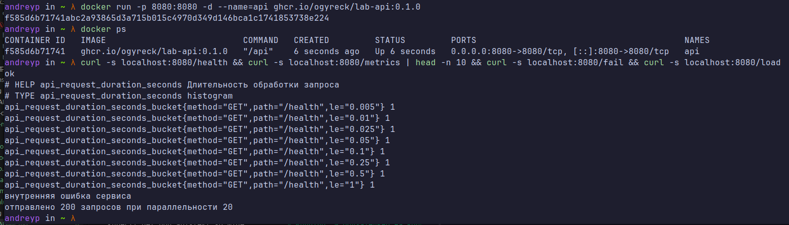

Все работает, метрики выводятся

И пушим его в ghcr

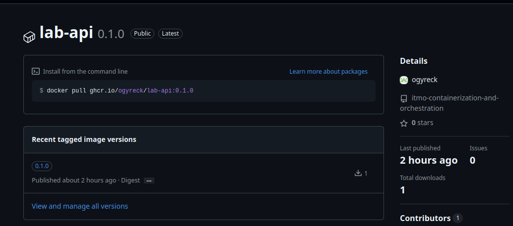

## Часть 1 - Метрики (Prometheus + Grafana)

### 1.1 Поднимаем стек мониторинга
Для начала нужно это все развернуть. Для разворачивания буду использовать k3s в домашней лаборатории. Описание стенда и то, как я разворачивал кластер, есть [вот тут](../generic/README.md). Вкратце: решил сделать себе отдельную ноду чисто под мониторинг. Задумка в том, чтобы сам стек наблюдения находился в стороне от того, за чем он наблюдает. Для этого при установке ноды-агента прописал в конфиге параметры: `k3s_node_labels:"purpose=monitoring"` и `k3s_node_taints: "purpose=monitoring:NoSchedule"`. Задумка хорошая, но добавляет трудностей при распределении приложений по нодам.

В качестве основы нашёл вот такой [helm чарт](https://artifacthub.io/packages/helm/prometheus-community/kube-prometheus-stack#configuration)
Немного почитал документацию и понял, что для настройки нужен values.yaml, пример которого разработчики предоставили

Выполнив команду `helm show values oci://ghcr.io/prometheus-community/charts/kube-prometheus-stack > value.yml`, получил файл на 6к строк. 6к!!!

После изучения всего этого понял, что мне нужны далеко не все 6к строк: свой файл содержит только отличия от значений по умолчанию, остальное чарт подставит сам. Финальный вариант — [values-pga.yaml](helm/values-pga.yaml)

Основные необычные моменты, которые я для себя открыл при составлении конфига

Параметр `nodeSelector` позволяет выбрать ноду.
```yml
    nodeSelector: 
      purpose: monitoring
```

А `tolerations` позволяет запускать приложение даже там, где есть ограничение 
```yml
    tolerations:
      - key: "purpose"
        operator: "Equal"
        value: "monitoring"
        effect: "NoSchedule"
```

И получается следующая ситуация: на ноде `k3s-mon` стоит taint `purpose=monitoring:NoSchedule`, который не даёт запускать на ней поды. В чарте указываю `nodeSelector: purpose: monitoring` - под едет только на эту ноду, а не куда-то ещё, - и toleration, которая разрешает игнорировать taint. В итоге стек приезжает на нужную ноду, а посторонние поды на неё не попадают. И это работает! Всё стало как нужно.

Похожую вещь сделал для node-exporter, только с `operator: "Exists"`: такая toleration терпит любой taint, поэтому агент встаёт на все ноды.

После чего применяем helm-чарт:

`helm upgrade --install kps oci://ghcr.io/prometheus-community/charts/kube-prometheus-stack --version 91.4.1 -n monitoring --create-namespace -f values-pga.yaml` 

И проверяем, что все поднялось:

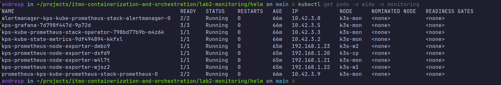

## 1.2 Деплой приложения 

Для деплоя приложения напишем [Helm chart](helm/api-chart/). Он будет состоять из трёх вещей:

  1. [Deployment](helm/api-chart/templates/deployment.yml) для запуска приложения. Настроим для него пробы, а также укажем имя порта, чтоб в дальнейшем на него ссылаться. Также укажем в нем, чтоб было две реплики.
  2. [Service](helm/api-chart/templates/service.yml) для сетевой доступности. 
  3. [Service Monitor](helm/api-chart/templates/servicemonitor.yml) для подключения его к прометеусу. 

И после чего этот чарт задеплоим: 

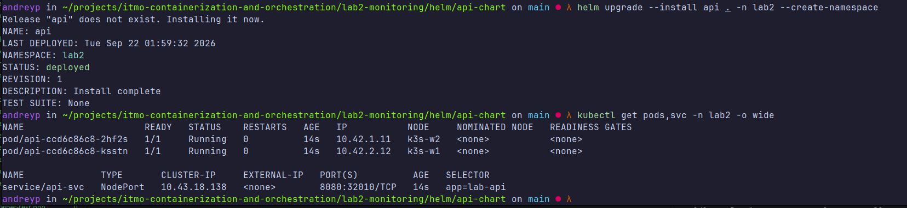

И также можем проверить, появился ли сервис как таргет в Prometheus:

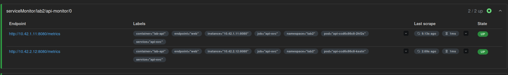
## 1.3 Дашборд RED

Дальше настроим дашборд в Grafana. Создадим три основные панели по RED: количество запросов, процент ошибок и время ответа. 

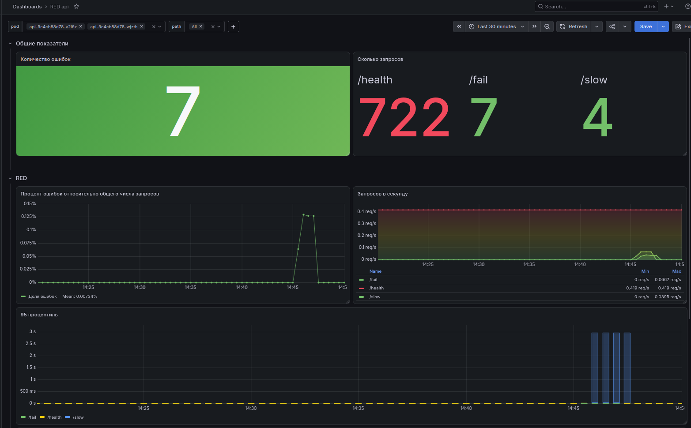

- "Запросов в секунду" считает `rate` от счётчика запросов с разбивкой по `path`
- "Процент ошибок относительно общего числа запросов" считает долю запросов, завершившихся ошибкой: отношение двух `rate`, а не абсолютное число
- "95 процентиль" считает p95 времени ответа из гистограммы длительностей 

Также для наглядности добавил счётчик ошибок и общее число запросов по разным путям. 

После этого экспортировал дашборд в JSON и положил его в чарт `api`: оттуда он приезжает в кластер как ConfigMap с меткой `grafana_dashboard`, а sidecar Grafana сам подкладывает его в интерфейс. Так дашборд переживает пересоздание пода Grafana и лежит в git рядом с сервисом. 


## Часть 2. Логи (Loki + Alloy)

### 2.1 Loki

Следующим шагом нужно развернуть Loki. Взял готовый Helm-чарт (честно говоря, возни с ним вышло больше, чем если бы я взял образ и написал всё сам). 

Добавил настройку, чтобы он поехал на ноду с мониторингом, - через `nodeSelector` и `tolerations`. Также настроил retention: логи хранятся 168 часов, под них PVC на 3G.

Отключил всё ненужное: внешнее S3, встроенный nginx-gateway, распределённый режим (выбрал single binary), кеши на memcached, а также тесты чарта и canary - отдельный под, который постоянно пишет и читает пробные логи, чтобы следить за самим Loki. 
### 2.2 Агент Alloy

Для Alloy тоже берём готовый helm-чарт. 

Из настроек: агенты должны стоять на всех нодах, поэтому toleration задаю через `operator: "Exists"` - она терпит любой taint. Тип контроллера - DaemonSet, чтобы на каждой ноде работало по одному агенту. 

Дальше собираем сам конвейер сбора логов:

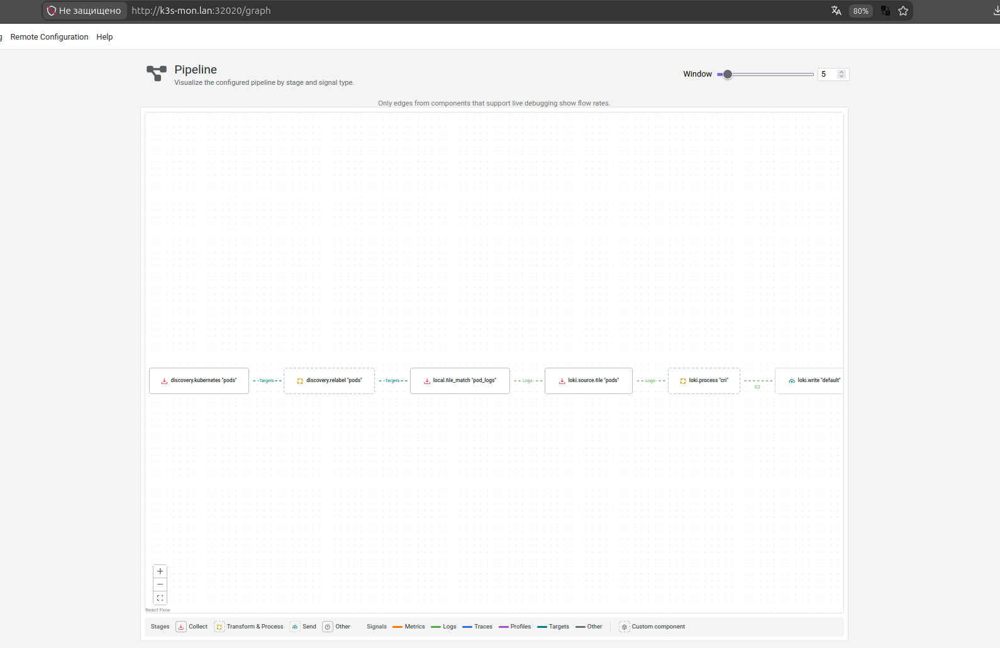

Сам конвейер собирается из блоков, каждый отдаёт результат следующему.

`discovery.kubernetes` - ходит в API кубера и находит все поды. На выходе цели со служебными метками вида `__meta_kubernetes_*`, читать их невозможно, поэтому дальше их надо разобрать.

`discovery.relabel` - тут две задачи. Первая простая: делаю из служебных меток нормальные - namespace, pod_name, pod_container_name, pod_node_name. Вторая интереснее: собираю путь до файла с логами. Кубер раскладывает их по схеме `/var/log/pods/<namespace>_<pod>_<uid>/<container>/*.log`, так что склеиваю четыре метки через `_`, разбираю регуляркой на группы и собираю путь обратно (возможно есть более простой способ, но я хз):

Пример того как выглядет файлы логов:
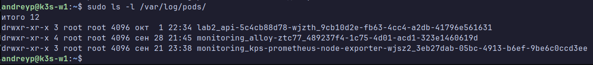

`local.file_match` - разворачивает маску `*.log` в список реальных файлов и каждые 10 секунд перепроверяет, не появились ли новые. Поды же постоянно пересоздаются.

`loki.source.file` - читает  файлы.

`loki.process` со `stage.cri` - тут мы с клодом сидели и разбирали, изначално логи нормально не парсились в grafana в виде json. И вот как раз `stage.cri` уберает все ненужно и рпевращает в нормальный лог,  который можно потом парсить как json(Дальше это нужно для jager)

`loki.write` - пушит все это в Loki.

В результате, логи красиов парсятся в json!


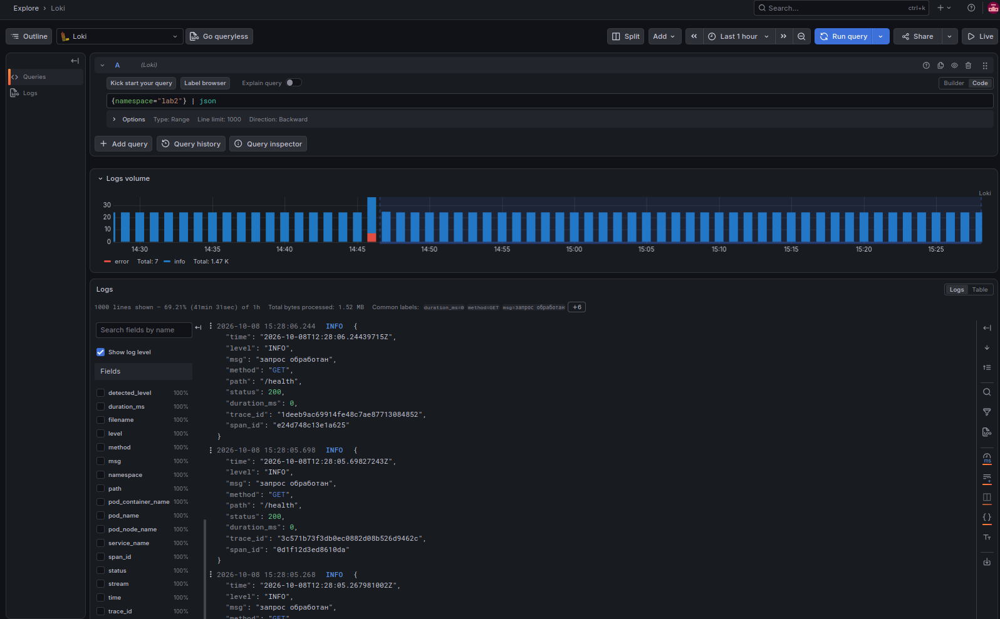

## Часть 3 — Трейсы (OpenTelemetry + Jaeger)

Сервис изначально написан с OpenTelemetry внутри, так что код трогать не пришлось. Он сам заводит корневой спан на каждый входящий запрос, в `/slow` оборачивает задержку во вложенный спан `slow-op`, а в `/fail` помечает спан как ошибочный - Jaeger такие красит красным. Плюс в каждую строку лога кладется `trace_id` текущего спана.
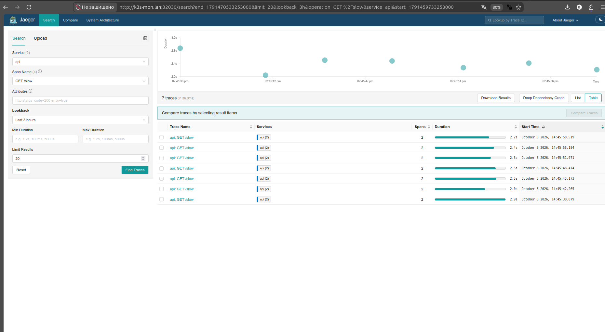

### 3.1 Jaeger

Ставил чартом `jaegertracing/jaeger`. По умолчанию он разворачивает промышленную раскладку с отдельными collector и query, да ещё и с Cassandra. Мне нужен был один под, поэтому почти весь конфиг пришлось писать руками: в этой версии Jaeger v2 конфигурируется целиком через `userconfig`, который заменяет дефолтный конфиг, а не дополняет его. Поэтому в values лежат и приёмники, и экспортеры, и расширения разом.

Хранилище выбрал `memory` с лимитом в 50 тысяч трейсов.


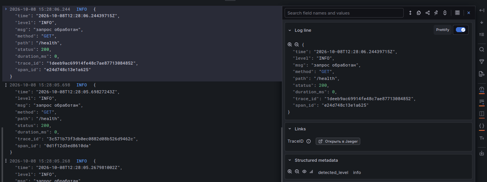
### 3.2 Связка логов и трейсов


Тут вылезла интересная ошибка. Datasource в Grafana типа Jaeger подключился, но тест выдавал ошибку. Как окзалаось,  версия графаны, не поддерживает новое апи Jagera. 


Вариантов было два: откатиться на Jaeger v1, где datasource работает штатно, либо оставить актуальную версию и сделать переход из лога прямой ссылкой. Выбрал второе. В datasource Loki добавил `derivedFields`: регулярка выдергивает `trace_id` из строки лога и превращает его в ссылку на интерфейс Jaeger.

```yaml
derivedFields:
  - name: "TraceID"
    matcherRegex: '"trace_id":"([^"]+)"'
    url: 'http://k3s-mon.lan:32030/trace/$${__value.raw}'
    urlDisplayLabel: "Открыть в Jaeger"
```

И в логе можно напрмую перейти в Jager и посмотреть его трейс


## Часть 4. Алерты (Alertmanager + Karma)

### 4.1 Правила

Правила описываются не в конфиге Prometheus, а объектом `PrometheusRule`, который подхватывает оператор. Положил его в чарт `api`.

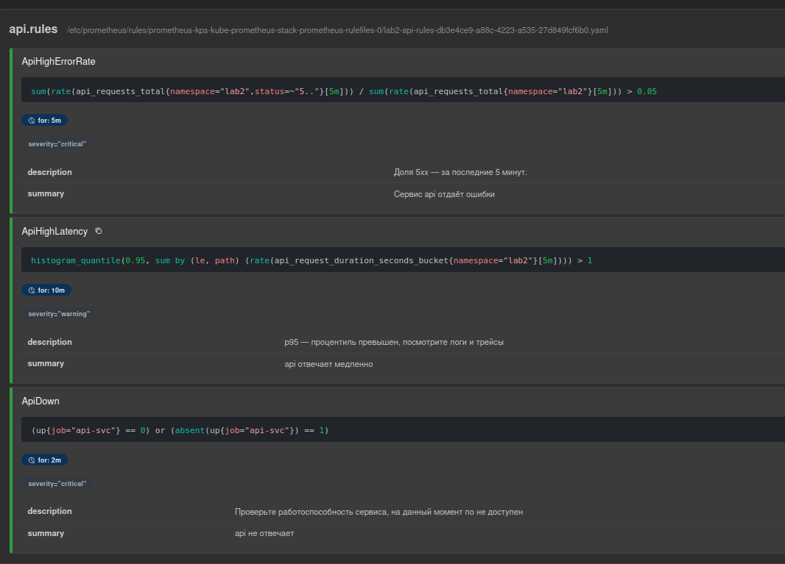

И для него сделал 3 правила:

- ApiHighErrorRate - доля ответов 5xx выше 5% в течение 5 минут

- ApiHighLatency - p95 больше секунды в течение 10 минут

- ApiDown - сервиса нет совсем


### 4.2 Маршрутизация и доставка

Приемником выбрал Telegram - у Alertmanager он встроенный. Креды положил в репу(знаю, что плохо, но это тестовый бот)

Пример алерта в тг:

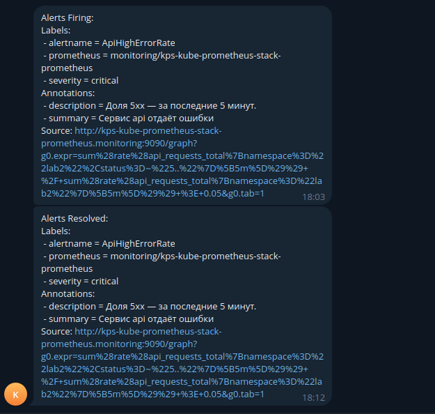


### 4.3 Karma

Karma - веб-интерфейс поверх API Alertmanager: сама ничего не хранит, просто опрашивает его и показывает активные алерты с группировкой и фильтрами. Готовые чарты для неё только сторонние и староватые, поэтому написал свой: Deployment, Service и ConfigMap с конфигом.

Из полезного в чарте - аннотация с хешем конфига:

```
checksum/config: {{ include (print $.Template.BasePath "/configmap.yml") . | sha256sum }}
```

Karma читает конфиг один раз при старте, поэтому без этого приёма обновлённый ConfigMap просто не доедет до работающего пода. Меняется конфиг - меняется хеш - Deployment пересоздаёт под.

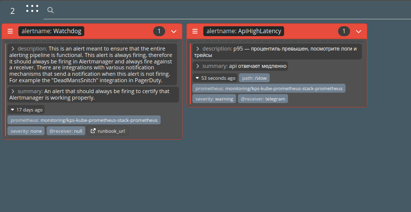


## Запуск всего стека одной командой

И также,  для простоты воспроизведения, подготовил отдельный [helmfile](helm/helmfile.yaml) чтоб можно было всю эту красоту развернуть одной командой.

```bash
helmfile apply
```
